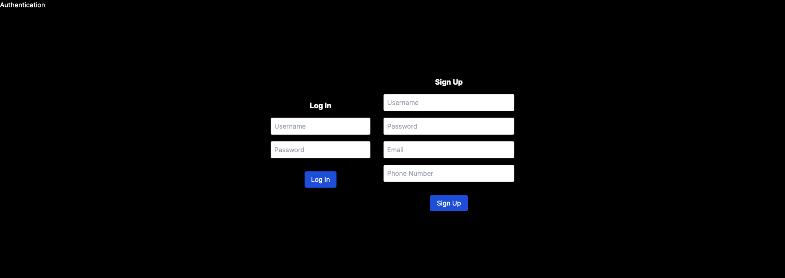
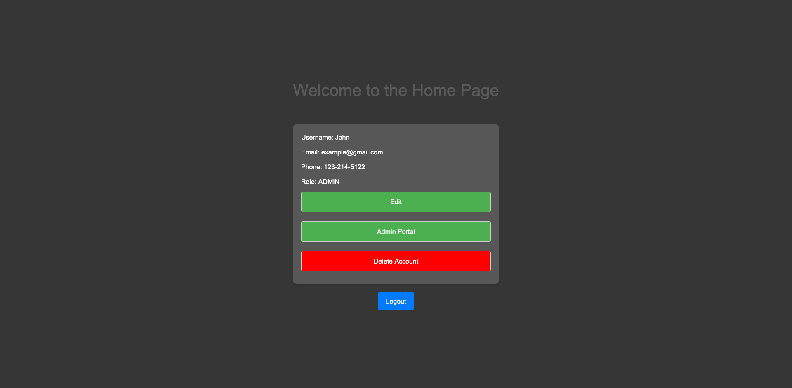
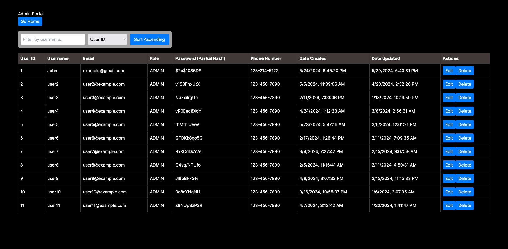

# Full Stack User Authentication System

## Overview
This project is a full-stack application consisting of a Spring Boot backend and a Next.js frontend. The backend provides REST APIs for user authentication and authorization, while the frontend offers a user-friendly interface for interacting with these services.

## Project Structure
- `backend/`: Contains the Spring Boot application.
- `frontend/`: Contains the Next.js application.
- `docs/`: Contains shared documentation.
  
## Architecture Diagram

## Database Table Structure

### `users` Table

The `users` table stores information about the users registered in the system. Here is the structure of the `users` table:

| Column Name  | Data Type           | Description                                           |
|--------------|---------------------|-------------------------------------------------------|
| user_id      | BIGINT              | Primary key, auto-incremented                         |
| username     | VARCHAR(255)        | Unique username for the user                          |
| password     | VARCHAR(255)        | Hashed password                                       |
| email        | VARCHAR(255)        | Email address of the user                             |
| phone_number | VARCHAR(20)         | Phone number of the user                              |
| role         | ENUM('ADMIN', 'USER')| Role of the user (either 'ADMIN' or 'USER')           |
| date_created | TIMESTAMP           | Timestamp of when the user was created                |
| date_updated | TIMESTAMP           | Timestamp of when the user details were last updated  |

#### Example Data

| date_created           | date_updated           | user_id | email            | password                                                   | phone_number | username | role  |
|------------------------|------------------------|---------|------------------|------------------------------------------------------------|--------------|----------|-------|
| 2024-05-24 18:45:20.843| 2024-05-29 18:40:31.617| 1       | example@gmail.com| $2a$10$5DS1NLLJk2QFOEuQ5| 123-214-5122 | John     | ADMIN |
| 2024-05-05 11:39:06.000| 2024-04-23 14:32:26.000| 2       | user2@example.com| y1S8FhxUtXuZ04UvkNTVAQ==| 123-456-7890 | user2    | ADMIN |

## Features

- **User Authentication**: Secure user authentication using JWT tokens.
- **Role-based Authorization**: Different access levels for admin and regular users.
- **User Management**: Admin portal for managing users and roles.
- **Responsive Design**: UI built with Next.js.
- **REST APIs**: Well-documented APIs for user management and authentication.
- **Secure Password Storage**: Passwords are hashed and stored securely using BCrypt.

## API Documenation
[API Documenation](/backend/docs/API.md)

## Tech Stack

**Frontend**:
- Next.js (React)
- Axios (for API requests)

**Backend**:
- Spring Boot (Java)
- Spring Security (for authentication and authorization)
- MySQL (Database)
- JPA/Hibernate (for ORM)

**Other**:
- JWT (for secure token-based authentication)
- Maven (for dependency management)

## Authentication Mechanism

### Using JWT Tokens and Cookies

The Full Stack User Authentication System uses JSON Web Tokens (JWT) and cookies to manage user authentication and maintain session state across client-server interactions. Here’s a detailed explanation of how this works:

1. **User Login**:
    - When a user logs in, the frontend (Next.js) sends the user's credentials (username and password) to the backend (Spring Boot) via an API request.
    - The backend validates the credentials. If valid, it generates a JWT token that encodes the user's identity and role.

2. **JWT Token Creation**:
    - The JWT token contains claims about the user, such as their username and role.
    - This token is signed using a secret key to ensure its integrity and authenticity.

3. **Sending the JWT Token to the Client**:
    - The backend sends the JWT token to the frontend as part of the response.
    - The frontend stores this token in an HTTP-only cookie to enhance security. HTTP-only cookies cannot be accessed via JavaScript, mitigating the risk of XSS attacks.

4. **Subsequent Requests**:
    - For any subsequent requests to protected endpoints, the frontend includes the JWT token by default, as the token is stored in a cookie that is automatically sent with each HTTP request.
    - The backend extracts the token from the cookie, validates it, and checks the user's authentication status.

5. **Token Validation**:
    - The backend verifies the token’s signature using the secret key. It also checks for token expiration and validity.
    - If the token is valid, the backend processes the request and the user is granted access to the requested resource based on their role.

6. **User Logout**:
    - When the user logs out, the frontend sends a logout request to the backend.
    - The backend responds by setting a new JWT cookie. This new cookie is expired and invalid. 

### Security Considerations

- **HTTP-only Cookies**: Storing the JWT token in an HTTP-only cookie prevents client-side scripts from accessing it, reducing the risk of XSS attacks.
- **Token Expiration**: JWT tokens have an expiration time, after which they become invalid. This limits the risk if a token is compromised.
- **Role-based Access Control**: The system uses roles encoded in the JWT token to enforce authorization checks, ensuring that users can only access resources for which they have permissions.

## Getting Started
### Prerequisites
- **Node.js**: Required for running the Next.js frontend.
- **Java Development Kit (JDK)**: Required for running the Spring Boot backend.
- **Maven**: For building the Spring Boot application.
- **MySQL**: The database used by the backend.

### Follow the [Installation Guide](/docs/INSTALLATION.md)

## Screenshots
### Auth Page

### Home Page

### Admin Portal
