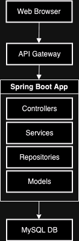

# User Authentication System

## Overview
The User Authentication System is a Spring Boot application that provides secure user authentication and authorization functionalities. It uses JWT for authentication and supports role-based access control.

## Features
- User registration and login
- JWT-based authentication
- Role-based authorization (Admin, User)
- Secure password storage using BCrypt
- API endpoints for managing users and roles

## Architecture

## Getting Started
Follow the [Installation Guide](INSTALLATION.md) to set up the project locally.

## API Documentation
Detailed API documentation is available in the [API Guide](API.md).
