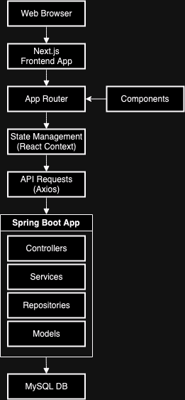

# System Architecture

## Overview

This document provides a high-level overview of the architecture of the Full Stack Application, which consists of a Spring Boot backend and a Next.js frontend. The architecture diagram and descriptions below illustrate how the different components interact to provide a seamless user experience.

## Architecture Diagram

## Components

### 1. Web Browser (Client)

- **Description**: The user interface through which users interact with the application. The frontend is built using Next.js, a React framework.
- **Responsibilities**: Handles user input, makes API calls to the backend, and renders dynamic content based on the application's state.

### 2. Next.js Frontend

- **Description**: The frontend application built using Next.js.
- **Responsibilities**:
  - **Routing**: Manages client-side and server-side routing.
  - **Components**: Modular components for different parts of the UI.
  - **State Management**: Manages the application's state using tools like React's Context API or third-party libraries like Redux.

### 3. Spring Boot Backend

- **Description**: The backend application built using Spring Boot.
- **Responsibilities**:
  - **Controllers**: Handle HTTP requests and map them to service methods.
  - **Services**: Contain business logic and interact with repositories.
  - **Repositories**: Interface with the MySQL database to perform CRUD operations.
  - **Security**: Manages user authentication and authorization using JWT.

### 4. MySQL Database

- **Description**: The relational database used to store user data and other persistent information.
- **Responsibilities**: Provides persistent storage for the application's data, such as user credentials, roles, and other relevant information.

## Data Flow

1. **User Interaction**: The user interacts with the web application via a web browser, performing actions like logging in, signing up, and accessing secured pages.
2. **API Requests**: The Next.js frontend makes API requests to the Spring Boot backend to perform these actions.
3. **Backend Processing**: The Spring Boot backend processes these requests, performing business logic and interacting with the MySQL database as needed.
4. **Database Operations**: The backend interacts with the MySQL database to fetch, update, or store data.
5. **Response to Client**: The backend sends the processed data back to the frontend, which updates the UI accordingly.

## Detailed Component Interaction

### Authentication Flow

1. **Login Request**: The user submits login credentials through the frontend.
2. **Token Generation**: The backend validates the credentials and generates a JWT token.
3. **Token Storage**: The frontend stores the JWT token (e.g., in cookies or local storage).
4. **Authenticated Requests**: Subsequent API requests from the frontend include the JWT token for authentication.

### Data Management

1. **Data Fetching**: The frontend requests data from the backend (e.g., user profile information).
2. **Service Layer**: The backend service layer processes the request, interacting with repositories if necessary.
3. **Database Interaction**: Repositories interact with the MySQL database to fetch or update data.
4. **Data Response**: The backend sends the requested data back to the frontend.

## Technologies Used

- **Frontend**: Next.js, React, CSS, HTML
- **Backend**: Spring Boot, Java, Maven
- **Database**: MySQL
- **Security**: JWT for authentication and authorization

## Conclusion

This architecture provides a robust foundation for building a full stack application with clear separation of concerns between the frontend and backend.

For more detailed information about each component, refer to the respective documentation in the `backend/docs` and `frontend/docs` directories.
